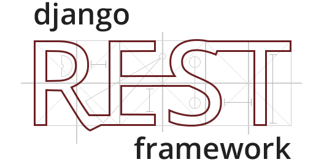

---?image=template/img/python-logo.svg&position=top right&size=25% auto&color=linear-gradient(to right, #306988, #ffda4b)
@title[Capa]

@snap[west text-20 text-bold text-white text-center]
10º Encontro da Comuniade  
_Python em Rondônia_
@snapend

@snap[south byline text-white text-06]
02 de novembro 2019    **Hollywood Pub**
@snapend

---?image=template/img/python-logo.svg&position=top right&size=25% auto&color=linear-gradient(to right, #306988, #ffda4b)
@title[Apresentação Pessoal]

## @color[white](Mas afinal quem é **Riverfount**?)

---?image=template/img/python-logo.svg&position=top right&size=25% auto&color=linear-gradient(to right, #306988, #ffda4b)
@title[Sobre mim]

@snap[north text-white span-100]
@size[1.3em](Bom, então, quem sou eu?)
@snapend

@snap[west about-team-pic]

@snapend

@snap[east text-06]
@color[#FFF](Riverfount, a.k.a. Vicente Marçal)
  
@fa[twitter icones](@vicentemarcal)
 @fa[telegram icones](@Riverfount)
 @fa[envelope icones](vicente.marcal@gmail.com)
 
@color[white](Professor do Departamento de Filosofia da Universidade Federal de Rondônia Pythonista por Hobby)
@snapend

---?image=template/img/python-logo.svg&position=top right&size=25% auto&color=linear-gradient(to right, #306988, #ffda4b)
@title[Agenda de Hoje]

@snap[midpoint span-65]
@box[bg-blue text-white rounded](Agenda#O que temos para hoje?)
@snapend

---?image=template/img/python-logo.svg&position=top right&size=25% auto&color=linear-gradient(to right, #306988, #ffda4b)

@title[Conteúdo Programado]

@snap[north]
@css[section-title](O que pretendo abordar)
@snapend

@snap[west list-content-concise span-100]
@ol
- Uma breve história do Python
- Mas, enfim, o que é a linguagem Python?
- O que podemos fazer com Python?
- O framework web Django e o DRF
- Mão na massa: Vamos fazer uma API RESTful 
@olend
  
@snapend

---?image=template/img/python-logo.svg&position=top right&size=25% auto&color=linear-gradient(to right, #306988, #ffda4b)
@title[A História do Python]

@snap[north]
@css[section-title](Uma breve história do Python)
@snapend

@snap[west span-20]

@snapend

@snap[east list-content-concise text-07 span-80]
@ol
- Python é uma linguagem moderna, de alto nível e de propósito geral
- Desenvolvida por Guido van Rossum, que a iniciou final da década de 1980 no CWI
- Sua filosofia enfatiza a legibilidade do código
- Seu nome vem do grupo de humor britânico Monty Python' Flying Circus
- A associação com a serpente Píton ocorre por sugestão da Editora O'Reilly que sempre coloca animais em suas capas
@olend
@snapend

---?image=template/img/python-logo.svg&position=top right&size=25% auto&color=linear-gradient(to right, #306988, #ffda4b)
@title[A História do Python]

@snap[north]
@css[section-title](Uma breve história do Python)
@snapend

@snap[west span-20]

@snapend

@snap[east list-content-concise text-07 span-80]
@ol
- Em 21 de fevereiro de 1991 van Rossum libera a linguagem pela priemira vez em um newsgroup chamado alt.sources, na versão 0.9.0, licenciada com uma cópia da licença MIT.
- Apesar de atualmente termos duas versões do Python, a 2.7.16 e a 3.8.0, a 2.7.16 está chegando ao seu fim com data prevista para encerrar seu suporte para 1º de janeiro de 2020, como pode ser visto nesse site: https://pythonclock.org/
- É indicado, sempre, trabalhar com a versão estável mais recente.
@olend
@snapend

---?image=template/img/python-logo.svg&position=top right&size=25% auto&color=linear-gradient(to right, #306988, #ffda4b)
@title[A História do Python]

@snap[north]
@css[section-title](Mas, enfim, o que é a linguagem Python?)
@snapend

@snap[west span-20]

@snapend

@snap[east list-content-concise text-07 span-80]
@ol
- Uma lingagem fácil e intuitiva, mas ao mesmo tempo tão poderosa quanto suas concorrentes
- Código aberto, para que qualquer um possa contribuir para o desenvolvimento - Uma linguagem de programação feita por e para programadores(as)
- Expressa-se em alto nível, quase um documento escrito em inglês
- Adequada para automatização de tarefas diárias, mas não só, com baixo custo de tempo no desenvolvimento de um scritp/aplicação
@olend
@snapend

---?image=template/img/python-logo.svg&position=top right&size=25% auto&color=linear-gradient(to right, #306988, #ffda4b)
@title[A História do Python]

@snap[north span-40]
@css[section-title](O que podemos fazer com Python?)
@snapend

@snap[west span-20]

@snapend

@snap[east list-content-concise text-07 span-80]
@ol
- Apesar de sua notoriedade no desenvolvimento web, Python é utilizada em diversas outras áreas.
- Aplicações Desktop
- Computação Científica
- Computação Gráfica
- Desenvolvimento de Games
- Ambiente Empresarial (ERP, por exmplo)
@olend
@snapend

---?image=template/img/python-logo.svg&position=top right&size=25% auto&color=linear-gradient(to right, #306988, #ffda4b)
@title[A História do Python]

@snap[west span-50]

@snapend

@snap[east list-content-concise text-07 span-50]
@ol
- Framework para desenvolvimento Web
- Criado em 2003 por Adrian e Simon como ferramenta interna de publicação web de um jornal local
- Em 2005 tornou-se Open Source 
- Um admin integrado que permite rapidamente entregar um CRUD para manutenção dos Modelos
- Excelente Documentação
@olend
@snapend

---?image=template/img/python-logo.svg&position=top right&size=25% auto&color=linear-gradient(to right, #306988, #ffda4b)
@title[A História do Python]

@snap[west span-40]

@snapend

@snap[east list-content-concise text-07 span-50]
@ol
- É uma caixa de ferramentas poderosa e flexível para construir API's Web
- Fornece a possibilidade de se navegar na API via Web (um admin própiro)
- Facilmente implementa políticas de autenticação
- Serialização que suporta facilmente fontes de dados ORM e não ORM
- Extremamente personalizável
- Excelente Documentação
@olend
@snapend

---?image=template/img/python-logo.svg&position=top right&size=25% auto&color=linear-gradient(to right, #306988, #ffda4b)
@title[A História do Python]

@snap[midipoint]
@css[section-title](Bora Codar!?)
@snapend