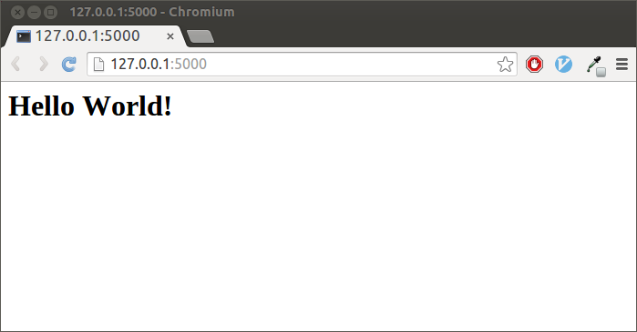
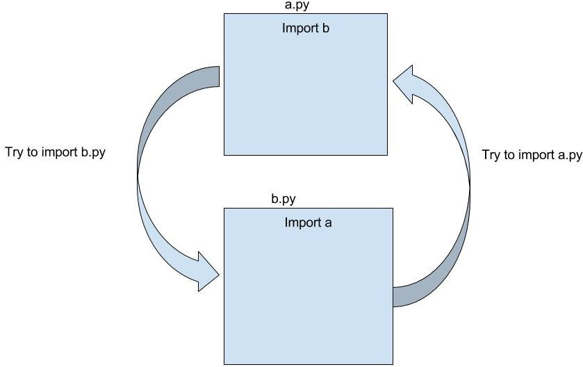

---?image=template/img/python-logo.svg&position=top right&size=25% auto&color=linear-gradient(to right, #306988, #ffda4b)
@title[Capa]

@snap[west text-20 text-bold text-white text-center]
9º Encontro da Comuniade <br>
_Python em Rondônia_
@snapend

@snap[south byline text-white text-06]
29 de março 2019 <br>  **Livraria Exclusiva Café & Cultura**
@snapend

---?image=template/img/python-logo.svg&position=top right&size=25% auto&color=linear-gradient(to right, #306988, #ffda4b)
@title[Apresentação Pessoal]

## @color[white](Mas afinal quem é<br>**Riverfount**?)


+++?image=template/img/python-logo.svg&position=top right&size=25% auto&color=linear-gradient(to right, #306988, #ffda4b)
@title[Sobre mim]

@snap[north text-white span-100]
@size[1.3em](Bom, então, quem sou eu?)
@snapend

@snap[west about-team-pic]

@snapend

@snap[east text-06]
@color[#FFF](Riverfount, a.k.a. Vicente Marçal)
<br><br>
@fa[twitter icones](@vicentemarcal)
<br>@fa[telegram icones](@Riverfount)
<br>@fa[envelope icones](vicente.marcal@gmail.com)
<br>
@color[white](Professor do Departamento de Filosofia<br>da Universidade Federal de Rondônia<br>Pythonista por Hobby)
@snapend

---?image=template/img/python-logo.svg&position=top right&size=25% auto&color=linear-gradient(to right, #306988, #ffda4b)
@title[Agenda de Hoje]

@snap[midpoint span-65]
@box[bg-blue text-white rounded](Agenda#O que temos para hoje?)
@snapend

+++?image=template/img/python-logo.svg&position=top right&size=25% auto&color=linear-gradient(to right, #306988, #ffda4b)

@title[Conteúdo Programado]

@snap[north]
@css[section-title](O que pretendo abordar)
@snapend

@snap[west list-content-concise span-100]
@ol
- Aplicação Flask e sua arquitetura
- O problema do Circular Imports
- Application Factory e Blueprints
- Dockerizando a Aplicação Flask
@olend
<br><br>
@snapend

---?image=template/img/python-logo.svg&position=top right&size=25% auto&color=linear-gradient(to right, #306988, #ffda4b)
@title[A Aplicação Flask]

@snap[midpoint]

@snapend

+++?image=template/img/python-logo.svg&position=top right&size=25% auto&color=linear-gradient(to right, #306988, #ffda4b)
@title[O que é o Flask]

@snap[midpoint span-65]
@box[bg-blue text-white rounded](O que é o Flask#Um framework para Python baseado no Werkzeug, Jinja2, sendo Drop on a time.)
@snapend

+++?image=template/img/python-logo.svg&position=top right&size=25% auto&color=linear-gradient(to right, #306988, #ffda4b)
@title[Werkzeug]

@snap[midpoint span-80]
@box[bg-blue text-white](Werkzeug.#O Werkzeug é uma abrangente biblioteca WSGI (Web Server Gatewway Interface) para aplicações Web)
@snapend

+++?image=template/img/python-logo.svg&position=top right&size=25% auto&color=linear-gradient(to right, #306988, #ffda4b)
@title[Jinja2]

@snap[midpoint span-80]
@box[bg-blue text-white](Jinja2.#Jinja2 é um completo mecanismo de templates para Python. Possui um completo suporte para unicode e ambiente de execução integrado)
@snapend

+++?image=template/img/python-logo.svg&position=top right&size=25% auto&color=linear-gradient(to right, #306988, #ffda4b)
@title[Drop on a time]

@snap[midpoint span-80]
@box[bg-blue text-white](Drop on a time.#Uma gota por vez: a proposta do Flask é intervir o mínimo possível, assim fornece o básico para uma aplicação Web, o restante é de inteira responsabilidade do Desenvolvedor.)
@snapend

+++?image=template/img/python-logo.svg&position=top right&size=25% auto&color=linear-gradient(to right, #306988, #ffda4b)
@title[Uma aplicação simples]

## @color[white](Uma aplicação Flask simples pode ser criada com apenas 5 linhas de código)

+++?image=template/img/python-logo.svg&position=top right&size=25% auto&color=#002b36

@title[O Código]
@snap[north]
@color[white](O arquivo app.py)
@snapend

```python
from flask import Flask
app = Flask(__name__)
@app.route('/')
def index():
    return "<h1>Hello World!</h1>"
    
```
@snap[south span-100]
@[1, zoom-17](Importamos a classe Flask que nos dá a interface WSGI)
@[2, zoom-17](Instanciamos a aplicação no objeto app)
@[3, zoom-17](Usamos o decorator @app.route para informar a função que responde pela rota '/')
@[4-5, zoom-17](Nossa função que responde pela rota '/' e retorna uma string simples com o fomoso "Hello World" )
@snapend

+++?image=template/img/python-logo.svg&position=top right&size=25% auto&color=linear-gradient(to right, #306988, #ffda4b)
@title[O Resultado]

### @color[white](Assim, temos o seguinte resultado)



+++?image=template/img/python-logo.svg&position=top right&size=25% auto&color=linear-gradient(to right, #306988, #ffda4b)
@title[Ampliando nossa App]

### @color[white](Uma aplicação é muito maior do que o Hello World!!)

+++?image=template/img/python-logo.svg&position=top right&size=25% auto&color=#002b36
@title[App e Views]

@snap[west]
app.py
@code[python](template/src/app.py)
@snapend

@snap[east]
views.py
@code[python](template/src/views.py)
@snapend

---?image=template/img/python-logo.svg&position=top right&size=25% auto&color=linear-gradient(to right, #306988, #ffda4b)
@title[Circular Import]

@color[white](O problema do Circular Import)



+++?image=template/img/python-logo.svg&position=top right&size=25% auto&color=linear-gradient(to right, #306988, #ffda4b)
@title[Explicando o Circular Import]

@snap[midpoint span-80]
@box[bg-blue text-white](Circular Import#Como vimos pela ilustração é o fato de app.py importar views.py que, por sua vez importa app.py)
@snapend

---?image=template/img/python-logo.svg&position=top right&size=25% auto&color=linear-gradient(to right, #306988, #ffda4b)
@title[Application Factory e Blueprints]

@snap[north span-70]
@box[bg-blue text-white](Proposta de Solução#Application Factory e Blueprints)
@snapend

@snap[west span-40]
@box[bg-blue text-white fragment](Application Factory#É um padrão no qual passamos a app para cada extenção ou blueprint para que esta seja configurada)
@snapend

@snap[south-west fragment]

@snapend

@snap[east span-40]
@box[bg-blue text-white fragment](Blueprints#É um conceito utilizado para dividir uma aplicação grande num conjunto de aplicações menores.)
@snapend

@snap[south-east fragment]

@snapend

+++?image=template/img/python-logo.svg&position=top right&size=25% auto&color=#002b36

@title[A Arquitetura da Aplicação]
@snap[north]
@color[white](A Arquitetura da Aplicação)
@snapend

```
.
├── backend
│   ├── app.py
│   ├── blueprints
│   │   ├── core
│   │   │   ├── bp.py
│   │   │   ├── __init__.py
│   │   │   ├── views.py
│   │   ├── __init__.py
│   ├── __init__.py
├── Dockerfile
├── Pipfile
├── Pipfile.lock
└── README.md
```
@[2,3,10]
@[4-9]
@[11]
@[12]
@[13]
@[14]

+++?image=template/img/python-logo.svg&position=top right&size=25% auto&color=#002b36

@title[O app.py]
@snap[north]
@color[white](O app.py)
@snapend

```python
from flask import Flask


def create_app():
    app = Flask(__name__)
    app.config['SECRET_KEY'] = 'My_Top_Secert_Key'

    # Blueprint

    from backend.blueprints.core import bp as bp_core #noqa
    bp_core.config(app)

    return app
    
```
@[1]
@[4]
@[5]
@[6]
@[10]
@[11]
@[13]

+++?image=template/img/python-logo.svg&position=top right&size=25% auto&color=#002b36

@title[O app.py]
@snap[north]
@color[white](O bp.py)
@snapend

```python
from flask import Blueprint


bp = Blueprint('core', __name__)


def config(app):
    from backend.blueprints.core import views # noqa
    app.register_blueprint(bp)
    
```
@[1]
@[4]
@[7]
@[8]
@[9]

+++?image=template/img/python-logo.svg&position=top right&size=25% auto&color=#002b36

@title[O views.py]
@snap[north]
@color[white](O views.py)
@snapend

```python
from backend.blueprints.core.bp import bp


@bp.route('/')
def home():
    return "<h1>Hello World</h1>"
```
@[1]
@[4]
@[5]
@[6]

+++?image=template/img/python-logo.svg&position=top right&size=25% auto&color=linear-gradient(to right, #306988, #ffda4b)
@title[Conclusão Arquitetura]


@snap[midpoint span-80]
@box[bg-blue text-white](Conclusão da Arquitetura#Com isso vemos como é simples separar as funcionalidades de nossa aplicação em Blueprints e ganhar em modularidade, bem como, superar o problema do Circular Imports)
@snapend

---?image=template/img/python-logo.svg&position=top right&size=25% auto&color=linear-gradient(to right, #306988, #ffda4b)
@title[Dokerizand a Aplicação Flask]

@snap[west]

@snapend

@snap[east]

@snapend

+++?image=template/img/python-logo.svg&position=top right&size=25% auto&color=linear-gradient(to right, #306988, #ffda4b)
@title[Introdução]


@snap[midpoint span-80]
@box[bg-blue text-white](Flask e Docker#Já vimos como iniciar a implementação de nossa aplicação Flask. Agora veremos como colocá-la em um container Docker. Não vamos tratar aqui como instalar o Docker, partimos do pressuposto que o mesmo já encontra-se instalado!)
@snapend

+++?image=template/img/python-logo.svg&position=top right&size=25% auto&color=#002b36

@title[O Dockerfile]
@snap[north]
@color[white](O Dockerfile)
@snapend

@code[yaml zoom-10](template/src/dockerfile.yml)

@[1]
@[2-4]
@[5-8]
@[9]
@[10]
@[11]
@[12-14]
@[15]
@[16]
@[17]

+++?image=template/img/python-logo.svg&position=top right&size=25% auto&color=#002b36

@title[Buildando a Imagem]
@snap[north]
@color[white]("Buildando" a nossa imagem)
@snapend

```
docker build -t vm_img_flask .
```
@box[bg-blue text-white](Executando o comando acima no terminal a imagem de nossa aplicação é criada!)


+++?image=template/img/python-logo.svg&position=top right&size=25% auto&color=#002b36

@title[Subindo o Container]
@snap[north]
@color[white](Subindo nosso Contaier)
@snapend

```
docker run -d --name my_app -p 5000:5000 vm_img_flask
```
@box[bg-blue text-white](Executando o comando acima no terminal subimos o container com nossa aplicação já rodando!)

+++?image=template/img/python-logo.svg&position=top right&size=25% auto&color=#002b36

@title[Testando a API]
@snap[north]
@color[white](Testando a API)
@snapend

```
$ http 0.0.0.0:5000
HTTP/1.0 200 OK
Content-Length: 11
Content-Type: text/html; charset=utf-8
Date: Tue, 29 Mar 2019 15:17:24 GMT
Server: Werkzeug/0.14.1 Python/3.7.1

Hello World
```

---?image=template/img/python-logo.svg&position=top right&size=25% auto&color=linear-gradient(to right, #306988, #ffda4b)
@title[Agradecimento]


@snap[midpoint span-80]
@box[bg-blue text-white](É isso aí pessoal#Muito obrigado pela oportunidade!)
@snapend